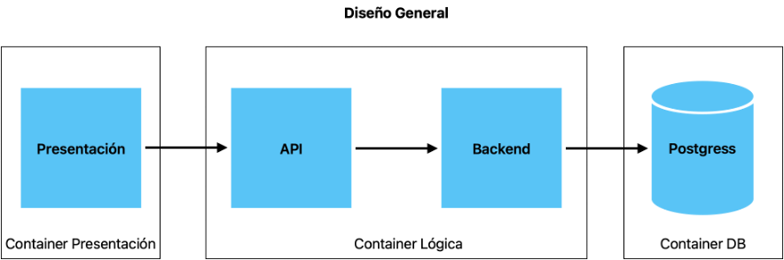

### Product Vision
Gestor de incidencias que permita crear, actualizar y consultar incidencias

### Arquitectura
Stack: Python/FastAPI
DB: Postgress
Contenerización: Podman
CI: Github Actions/Worflows
Branching: fetaure – develop – release – main

 

### DevSecOps inicial

Manejo de Secretos en Github. Inicialmente de forma local al repositorio.

### Security checklist y 2 risks.

Riesgo 1: 
Vulnerabilidad por almacenamiento de contraseñas en texto claro.
Mitigación: Almacenamiento de contraseña en SHA2 u otro algoritmo de hash de mejor prestación.

Riesgo 2: 
Vulnerabilidad por uso de stack antiguo.
Mitigación: Emplear últimas versiones de las herramientas.
